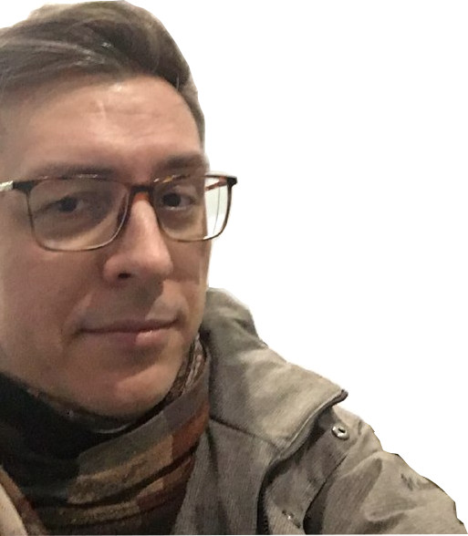

# Alexander Zakamaldin
***
azakamaldin@gmail.com

telegram: @zak_zakka

twitter: @alex_zakka

mobile/whatsapp: +79502247888

Discord: @zakka#4684

07/28/1979

## I'm Looking for a job where I can improve my development or devops skills.
It could be JS/FE Engineer, SRE, DevOps, QA, Big Data Engineer, Data Scientist or Statistical Analyst position

### Skills
<!-- Навыки (языки программирования, фреймворки, методологии, системы контроля версий и инструменты разработки, которыми вы владеете) -->
* Advanced at Bash, Perl
* Beginer at Python, JavaScript, Java, Kotlin
* Expirienced at Linux, Windows servers
* Familiar at monitoring tools: Nagios, Zabbix, Grafana
* Have some expirience at configuration and version control management (Ansible, Git)
* Mentoring engineers, lead small teams

### Sample of Code
```
function disemvowel(str) {
  str = str.replace(/[e|E|y|Y|u|U|i|I|o|O|a|A]/g,'');
  console.log(1, str);
  return str;
}

let str = 'This website is for losers LOL!';
console.log(2, str);
str = disemvowel(str);
console.log(3, str);
```
### Same Code from Codewars
[`https://www.codewars.com/kata/reviews/52fba700adcd10b182000980/groups/63223350b2d37c0001f3a40f`](https://www.codewars.com/kata/reviews/52fba700adcd10b182000980/groups/63223350b2d37c0001f3a40f "Link to my code at Codewars")

---

### Work expirience

**February 2015 - present** PJSC Megafon SZF, Senior Ops Engineer

* Develop and maintain the mobile operator telematic services
  - These are services that affect subscribers' SMS traffic or provide information via SMS. 
* Traffic management at the network, session and application interaction levels (http-api)
* Deployment CentOS/RockyLinux based servers
* Setting up High Availability clusters (VMWare, Ovirt)
* Optimizing administration tasks using Bash, Perl, Python
* Parsing large amounts of data files and databases
* Drawing the interaction/traffic flow schemes, writing instructions and documentation
* Writing test scripts for tester teams. Testing processes organizing
* Project and service management (Jira), document management in SAP
* Participate in negotiations and conferences with suppliers and customers 

**July 2011 — January 2015** Corporate Systems Plus, implementation engineer

* Deployment of virtualization sites using XenServer, VMware vSphere
* Server administration Linux (Apache, MySQL, Postfix)
* Administration of Windows servers (DC, GPO, DNS, DHCP, Exchange)
* Installation of the ClearOS edge security server (Firewall, intrusion prevention system, intrusion detection system)
* Configuration and administration of network equipment Dlink, Cisco
* Setting up storage systems Huawei Oceanspace, HP MSA
* Building a telephony system (Asterisk)
* Training and user support (including English speakers)

**October 2006 — May 2011** Intellect Partner (Magnitogorsk), technical sale

* Establishing of a competence center in the data center technologies (APC, Emerson)
* Obtaining company competencies as MS Gold Partner (SharePoint)
* Technical support sales support, direct sales
* Telecommunication system modernization of the metallurgical industrial site (AVAYA)
* Planning the renewal of cooling systems for several heavy industry data centers (Uniflair)
* Design and installation of Hyper-V virtual server farms
* Development concepts of a training center online learning system based on Microsoft Learning Gateway (SharePoint, Communication Server)
* Integration of MS Dynamics CRM into an enterprise information system
* Prepare presentations and round tables on new technologies and solutions

**October 2001 — September 2006** Research Institute of Physiology SB RAMS (Novosibirsk), scientist/bioinformatic

* Examined psychophysiological aspects of the perception emotional stimuli 
* Research areas: neurophysiology of stress, meditation, subliminal processes
* Design and development the research systems (visual and sound stimulation, experiment management, relaxation systems): writing concepts, technical specifications, managing research software development                                                                                                                                                                                                                                                                                        
* Participation at the machine vision systems programming (С#)
* Setting up and troubleshooting the medical equipment software
* Biophysical data acquisition and analysis (Neurosoft, Statistica, SPSS)
* Writing reports, articles, presentations.
* Speaking at international conferences and seminars

---

### Education

* 2001, Magnitogorsk State Technical University, composite materials engineer
  
  Graduate research work “Rheological model of non-compact plastic masses extrusion: Tensor analysis”
* 2010 Course Microsoft Server Virtualization: Architecture
* 2011 Intermediate English Language
* 2015 RH254 Red Hat - System Administration III
* 2019 Red Hat Enterprise Virtualization

### My English Level
* English A2 (EPAM Test passed on 06.09.2022)
* Able to speak simple or tech topics
* Have some expirience at conference and negotiations

---

### A little about myself

>I am grateful to the Novosibirsk Akademgorodok for giving me a natural-scientific view of the world and the optimism in the endless process of cognition.

I like to travel by car, robots, hiking, avant-garde visual arts and architecture, classical and electronic music, jazz and progressive rock. I love nature and animals.
